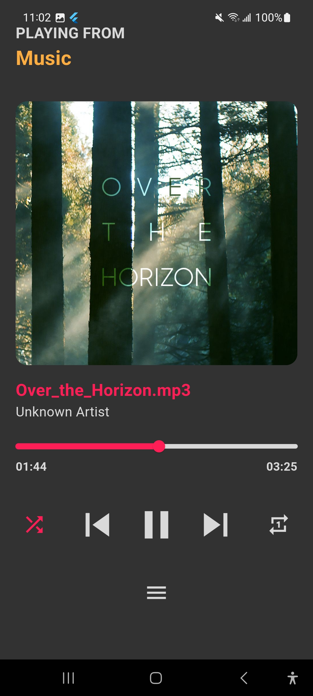
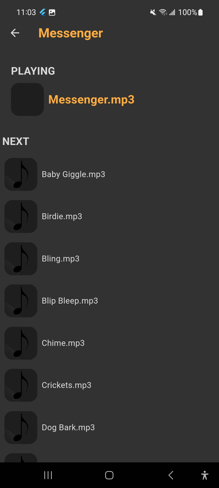

# 🎧 Audio Player App

A minimalist audio player built with **Flutter** and **Dart**. It supports local playback, playlist browsing, and interactive controls.

## 🚀 Features

- Audio playback (play, pause, next)
- Playlist view
- Repeat and shuffle
- Local file scanning

## 🖼️ Screenshots

| Home | Playlist | Player | Next |
|------|----------|--------|------|
|  |  |  |  |

## 📦 Getting Started

```bash
git clone https://github.com/your-username/audio-player.git
cd audio-player
flutter pub get
flutter run
